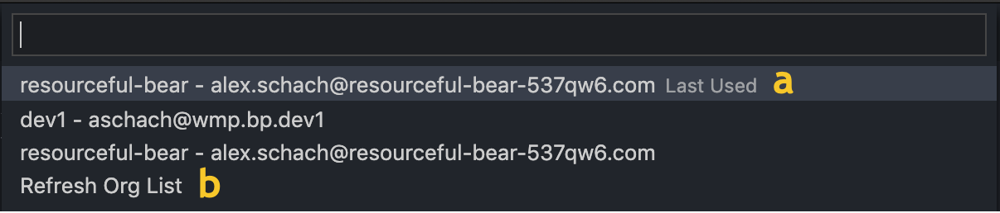
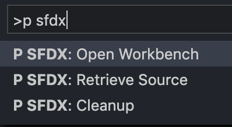
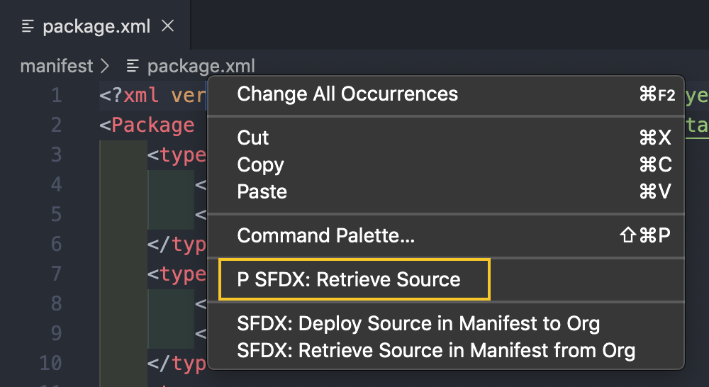
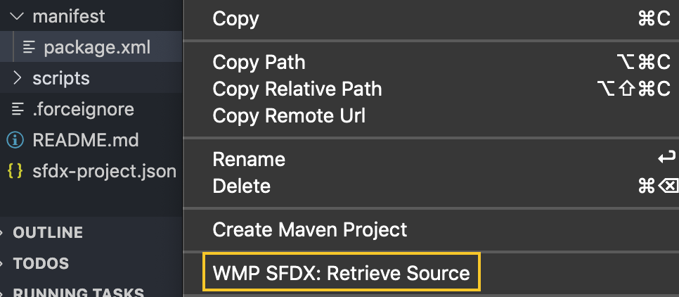

# WMP SFDX
This VS Code extension allows for easy access and use of [sfdx-dmg-plugin](https://github.com/dmgerow/sfdx-dmg-plugin) commands via the Command Palette, Explorer, and Editor.

## Installation
1. Install [sfdx-dmg-plugin](https://github.com/dmgerow/sfdx-dmg-plugin)

2. [Download Extension](https://github.com/wmpcx/wmp-sfdx/blob/master/versions/wmp-sfdx-0.0.1.vsix.zip)

3. In VS Code's Command Palette, search for and select `Extensions: Install from VSIX...`, and select the downloaded file.

## Commands

### WMP SFDX: Retrieve Source
Runs [Retrieve Source](https://github.com/dmgerow/sfdx-dmg-plugin#sfdx-dmgsourceretrieve--x-string--n--u-string---apiversion-string---json---loglevel-tracedebuginfowarnerrorfataltracedebuginfowarnerrorfatal) using the package at `/manifest/package.xml`

### WMP SFDX: Cleanup Source
Runs [Cleanup Source](https://github.com/dmgerow/sfdx-dmg-plugin#sfdx-dmgsourcecleanup---json---loglevel-tracedebuginfowarnerrorfataltracedebuginfowarnerrorfatal)

### WMP SFDX: Open Workbench
1. Presents a list of currently enabled orgs; retrieved via `sfdx force:org:list`

    a. Last used org for quick access

    b. Refresh org list if a new org was recently added

2. Runs [Open Workbench](https://github.com/dmgerow/sfdx-dmg-plugin#sfdx-dmgworkbenchopen--s-string--t-string--r-string--u-string---apiversion-string---json---loglevel-tracedebuginfowarnerrorfataltracedebuginfowarnerrorfatal) upon selection

## Invocation Methods

#### Command Palette (Cmd + Shift + P)

#### Right Click Editor (when `package.xml` is the active tab)

#### Right Click Explorer (when `package.xml` is the active tab)

#### Touchbar
#### (when `package.xml` is the active tab)
* Open Workbench
* Retrieve Source

#### (all other files)
* Open Workbench

## Settings
### Workbench
#### URL
* Set the URL for the Workbench instance you wish to use, either official SF or custom hosted. Defaults to https://wmpbench.herokuapp.com/.

<!-- ## Features

Describe specific features of your extension including screenshots of your extension in action. Image paths are relative to this README file.

For example if there is an image subfolder under your extension project workspace:

\!\[feature X\]\(images/feature-x.png\)

> Tip: Many popular extensions utilize animations. This is an excellent way to show off your extension! We recommend short, focused animations that are easy to follow.

## Requirements

If you have any requirements or dependencies, add a section describing those and how to install and configure them.

## Extension Settings

Include if your extension adds any VS Code settings through the `contributes.configuration` extension point.

For example:

This extension contributes the following settings:

* `myExtension.enable`: enable/disable this extension
* `myExtension.thing`: set to `blah` to do something

## Known Issues

Calling out known issues can help limit users opening duplicate issues against your extension.

## Release Notes

Users appreciate release notes as you update your extension.

### 1.0.0

Initial release of ...

### 1.0.1

Fixed issue #.

### 1.1.0

Added features X, Y, and Z.

-----------------------------------------------------------------------------------------------------------

## Working with Markdown

**Note:** You can author your README using Visual Studio Code.  Here are some useful editor keyboard shortcuts:

* Split the editor (`Cmd+\` on macOS or `Ctrl+\` on Windows and Linux)
* Toggle preview (`Shift+CMD+V` on macOS or `Shift+Ctrl+V` on Windows and Linux)
* Press `Ctrl+Space` (Windows, Linux) or `Cmd+Space` (macOS) to see a list of Markdown snippets

### For more information

* [Visual Studio Code's Markdown Support](http://code.visualstudio.com/docs/languages/markdown)
* [Markdown Syntax Reference](https://help.github.com/articles/markdown-basics/)

**Enjoy!** -->
